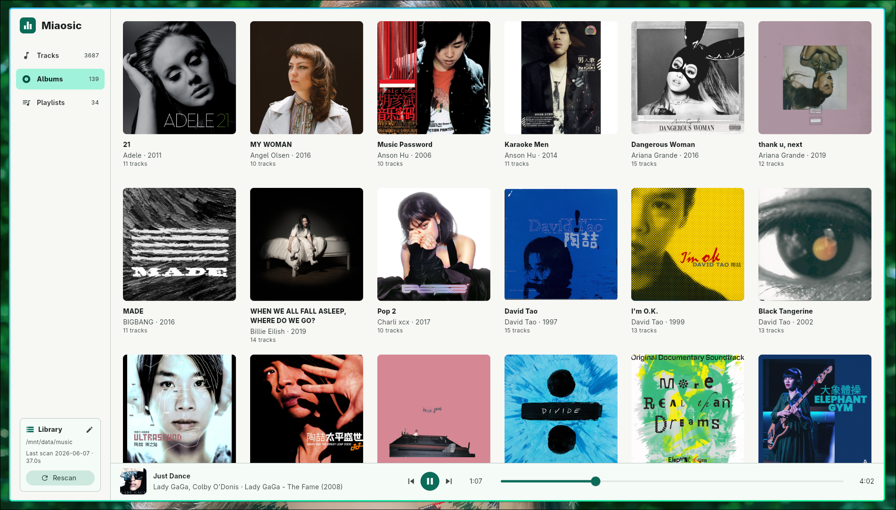
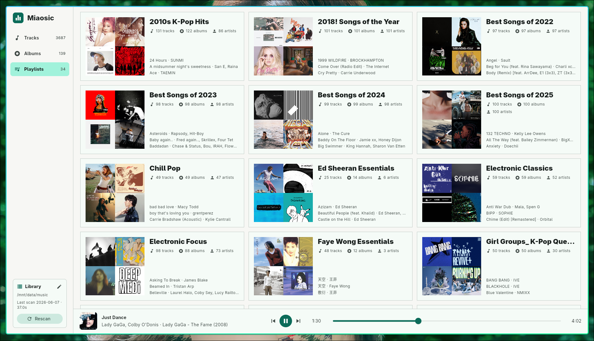

# Miaosic

Miaosic is a Linux-only, local-first FLAC music player. It scans a local music
folder, stores the library in SQLite, caches artwork, and plays tracks with
`media_kit`.

## Screenshots

| Albums | Playlists |
| --- | --- |
|  |  |

## Features

- FLAC library scanning through a Rust FFI scanner.
- Album and playlist-folder browsing.
- SQLite-backed local library state.
- Incremental rescan for fast refreshes after the first scan.
- Full rescan when metadata needs to be force-refreshed.
- Local cover art caching for smooth grids and lists.
- Linux playback through `media_kit`.

## Scope

Miaosic 0.2.0 is intentionally narrow:

- Supported runtime: Linux.
- Supported library format: `.flac`.
- Android, iOS, macOS, Windows, and web scaffolding exists but is not maintained.

## Library Data

The default music root is:

```text
$HOME/Music
```

The music root can be changed from the Library panel. The selected folder,
scanned library, and scan state are stored locally in the platform application
support directory. Cover files are cached under `covers/` in the same app data
area.

## Run

```sh
flutter run -d linux
```

## Build

```sh
flutter build linux --release
```

The release bundle is written to:

```text
build/linux/x64/release/bundle/
```

## Development Checks

```sh
flutter analyze
flutter test
cargo check --manifest-path native/music_core/Cargo.toml
flutter build linux --release
```

The scanner can also be run without opening the UI:

```sh
dart run tool/scan_dev.dart
```
