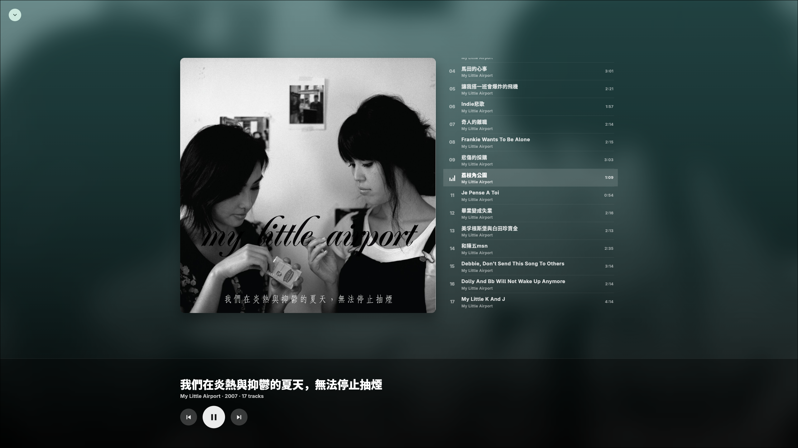

# Miaosic

Miaosic is a Linux-only, local-first FLAC music player. It scans a local music
folder, stores the library in SQLite, caches artwork, and plays tracks with
`media_kit`.

## Screenshots


## Features

- FLAC library scanning through a Rust FFI scanner.
- Album and playlist-folder browsing.
- SQLite-backed local library state.
- Incremental rescan for fast refreshes after the first scan.
- Full rescan when metadata needs to be force-refreshed.
- Local cover art caching for smooth grids and lists.
- Linux playback through `media_kit`.

## Scope

Miaosic is intentionally narrow:

- Supported runtime: Linux.
- Supported library format: `.flac`.
- Android, iOS, macOS, Windows, and web directories are Flutter-generated
  scaffolding only. They are not tested, packaged, or maintained as supported
  targets.

## Library Data

The default music root is:

```text
$HOME/Music
```

The music root can be changed from the Library panel. The selected folder,
scanned library, and scan state are stored locally in the platform application
support directory. Cover files are cached under `covers/` in the same app data
area.

## Run

```sh
flutter run -d linux
```

## Build

```sh
flutter build linux --release
```

The release bundle is written to:

```text
build/linux/x64/release/bundle/
```

If Flutter reports a stale CMake cache path after moving or copying the checkout,
reset the Linux build directory before rebuilding:

```sh
rm -rf build/linux
flutter build linux --release
```

## Development Checks

```sh
dart format --output=none --set-exit-if-changed lib test tool
flutter analyze
flutter test
cargo fmt --manifest-path native/music_core/Cargo.toml --check
cargo test --manifest-path native/music_core/Cargo.toml
flutter build linux --release
```

The scanner can also be run without opening the UI:

```sh
dart run tool/scan_dev.dart
```
